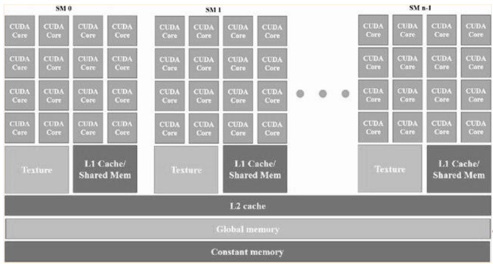

# Cuda 2

## Error handling

- Host functions (cudaMemcpy, cudaMalloc,…) return cudaError_t variable
- cudaGetLastError() returns error code for last kernel executed on the device
- cudaError_t is non-zero in case of errors – otherwise zero
- cudaGetErrorString() extracts meaningful error message from cudaError_t

## Memory

### Shared L1

- smallest unit in memory is 1 word (usually 4 bytes)
- divided into banks (usually 32)
  - $bank[i] = i \mod 32 \mid i$ is the address of one word in memory 
  - one warp can request at most one word from each bank at a time, otherwise bank conflict
  - multiple threads of one warp can request the same word without a bank conflict (the value is fetched once and then distributed via broad/multicast)

## Parent / Child Grid

- device code can create new grids
- the parent grid is not considered complete until all children have completed
